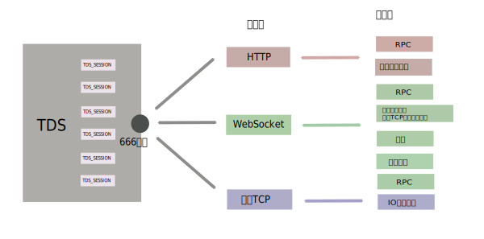
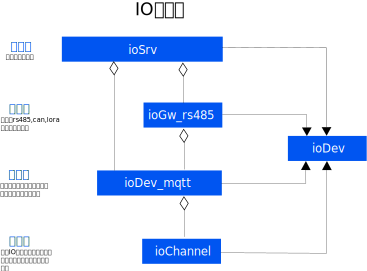
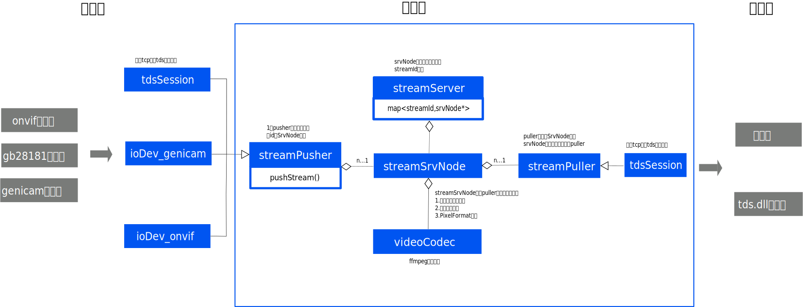

# TDS开发指南

## TDS整体模型

基于TDS构建的物联网监控系统，体系结构包含4个部分

| 模块         | 说明          | 平台                     |
| ---------- | ----------- | ---------------------- |
| Dev        | 硬件设备        | Modbus设备，485网关，4g网关DTU |
| IOServer   | IO服务，硬件设备接入 | 云平台/边缘端                |
| DataServer | 数据服务        | 云平台                    |
| Client     | 客户端         | 手机，PC                  |


## HTTP服务鉴权

采用Bearer Token机制进行客户端鉴权


## TDB数据库

TDS内置了TDB时序数据库，TDB基于文件系统的文件夹目录结构以及json文件来存储数据。

TDB是一个方便集成的，无第三方依赖的类库。仅在需要数据库更多功能的时候，需要集成

jerryScript。

## T-SVG拓扑图


## UI定制项目开发


## 重要机制

### 级联模式下的流数据访问

数据访问包含**当前值**和**数据流**两类，数据流指高频采样的数据，视频码流或者传感器的高频采样数据流，访问机制都按下图实现

### 

## SDK模式 二次开发

SDK模式下，包含 tds.h头文件，并将 tds.dll 放置在程序目录下即可。只要2-3行代码，即可完成TDS接入。

tds.dll使用动态加载模式，不需要在编译时链接库函数。

```C++
#include "tds.h"  //step 1

iTDS* tds = NULL; //tds接口对象指针，使用该接口的成员函数调用tds的相关功能
int main(int argc, char** argv)
{
    tds = getITDS(); //step2

    if (tds)
    {
        //tds中字符串默认使用utf8编码，如果需要在tds接口中传入gb2312编码需设置
        tds->setEncodeing("gb2312");
        tds->run(); //step3
    }
    else
    {
        printf("加载tds.dll失败，退出程序");
        exit(0);
    }

    //开始使用tds的功能
    // tds->XXXXX()
```

## TDS服务端口示意图



## IO设备类图



## 视频服务类图



## DataServer类

dataServer类负责管理所有的tcp连接和数据收发.

每一个tcp连接都使用一个 TDS_SESSION对象来进行管理.

底层由IOCP的tcp服务器进行数据接收,收到一个tdsSession上的数据后,都启动一个数据处理线程,对该tdsSession的数进行处理

在高并发短连接情况下,或者出现tcp在请求的处理尚未完成时断开的情况时, TDS_SESSION 对象依然在处理线程中使用.不能删除,因此TDS_SESSION使用共享指针来进行自动释放处理. 但是TCP连接断开时,会置空tdsSession内部的 tcpSession指针


## TDS-RPC接口

### MO查询类

## T-LOG日志规范

该日志规范主要为了方便日志的可视化

### 过程日志

过程日志通过 [开始:xxx] 和 [结束:xxx]格式表示,xxx代表该过程的命令。

过程是一个有开始有结束的流程，在可视化时通过在时间轴方向上的一个矩形色块来展示。

当存在多个连续的开始，忽略前面的开始，

当存在多个连续的结束，忽略后面的结束。过程例子   

```textile
2020-11-11 11:11:11.234 [对象:1J1][开始:读电参数曲线]
```

过程例子。过程的执行携带一个 [结果:XXX]

```textile
2020-11-11 11:11:11.234 [对象:1J1][结束:读电参数曲线][结果:成功]
```

```textile
2020-11-11 11:11:11.234 [对象:1J1][结束:读电参数曲线][结果:失败][错误信息:超时]
```

```textile
2020-11-11 11:11:11.234 [对象:1J1][结束:读电参数曲线][结果:失败][错误信息:发送失败]
```

```textile
2020-11-11 11:11:11.234 [对象:1J1][开始:确认电参数曲线]
```

```textile
2020-11-11 11:11:11.234 [对象:1J1][结束:确认电参数曲线][结果:失败][错误信息:超时]
```

### 操作日志

操作日志只有一条，没有开始和结束标记，但是带有一个  **[耗时:123]** 标签，单位为毫秒

在可视化上用一个矩形区域展示。

可能带有 **[结果:成功]**  或者 **[结果:失败]**  标签

```textile
2020-11-11 11:11:11.234 [对象:1J1][操作:读取实时值][耗时:3002]
```

### 事件日志

```textile
2020-11-11 11:11:11.234 [对象:1J1][事件:扳动开始]
```

```textile
2020-11-11 11:11:11.234 [对象:1J1][事件:扳动结束]
```

**掉线上线日志示例**

```textile
2020-11-11 11:11:11.234 [事件:设备掉线][对象:1J1] xxxx
```

```textile
2020-11-11 11:11:11.234 [事件:设备上线][对象:1J1] xxxx
```

### 流程标识

将操作，过程，事件等放在可视化的一行当中展示。

如果没有该标识，使用操作或者过程自己的名称作为1行。

如果有，使用该标识作为1行的名称

例如以下日志在可视化的一行当中展示

```textile
2020-11-11 11:11:11.234 [流程:电参数曲线采集][对象:1J1][操作:读取实时值][耗时:3002]
```

```textile
2020-11-11 11:11:11.234 [流程:电参数曲线采集][对象:1J1][开始:读电参数曲线]
```

```textile
2020-11-11 11:11:11.234 [流程:电参数曲线采集][对象:1J1][结束:读电参数曲线][结果:成功]
```
