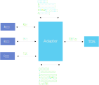
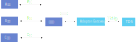

# Adaptor 适配器模式

## 概要

物联网设备有成千上万的设备协议，在 ：

* 低代码/无代码    基于界面元素配置，托拉拽进行通信协议组态

* 轻代码  基于脚本语言等开发更为快速的语言环境

* 重代码  基于传统开发语言，需要复杂编译开发环境的模式      

3种扩展模式中，TDS二次开发资源中提供了基于Node.js与javascript语言进行轻代码扩展的方式。

相对于无代码更加灵活易扩展，相对重代码更加简便快速。

TDS提供一个基于Nodejs的 Adaptor设备接入框架

## 一端点多设备

在adaptor模式下，与TDS只有一个连接端点，在该端点中同时会有多个io设备。

在上送数据包时，通过 ioAddr来区分设备

当ioAddr是ip地址格式是，认为设备和服务在同一个局域网，ip地址是有含义的

如果不是ip地址格式，则仅仅当作1个id来处理。

## 设备直连模型

Adaptor程序可以看做1根管道，在设备协议和TDS设备协议之间进行转换。

程序是无状态的，不保留设备列表，离线在线信息等。仅做数据转发与协议转换。

### 初始化

adaptor启动后，每隔1秒向tds服务发送 regAdaptor心跳

tds根据该心跳管理adaptor上线状态，记录adaptor通信地址

## 网关转接模型

网关转接模式是指现有系统已经对设备进行了统一接入，TDS只和统一接入的节点进行的的模式。例如园区监控当中，能耗监测子平台已经接入了所有电表，TDS只需要接入子平台的服务器，就可以接入所有电表设备

