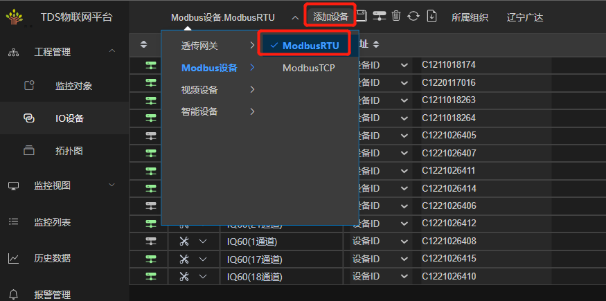
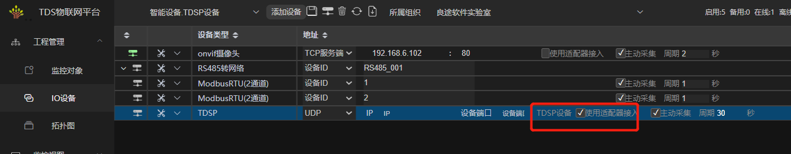
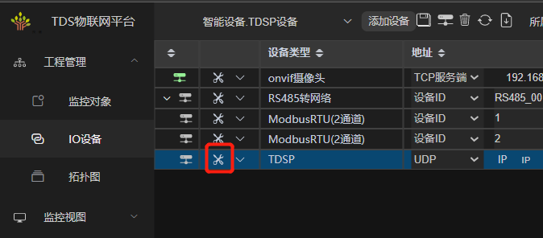
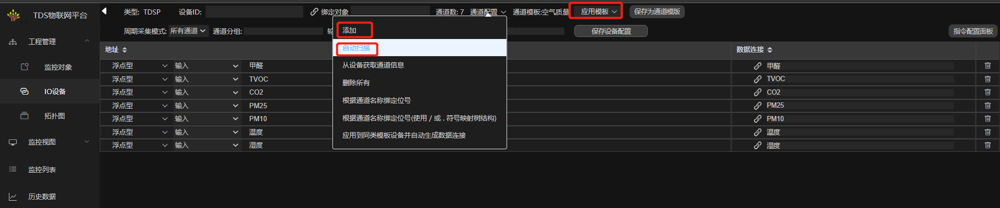
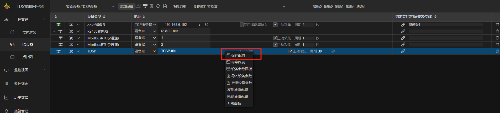
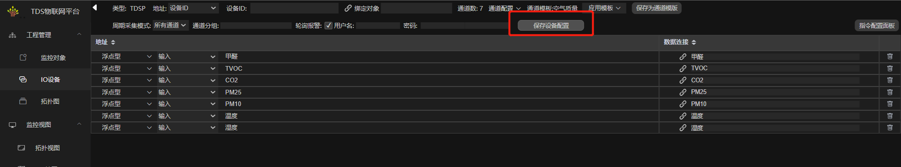
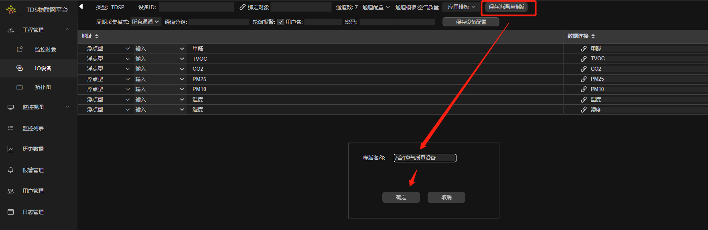
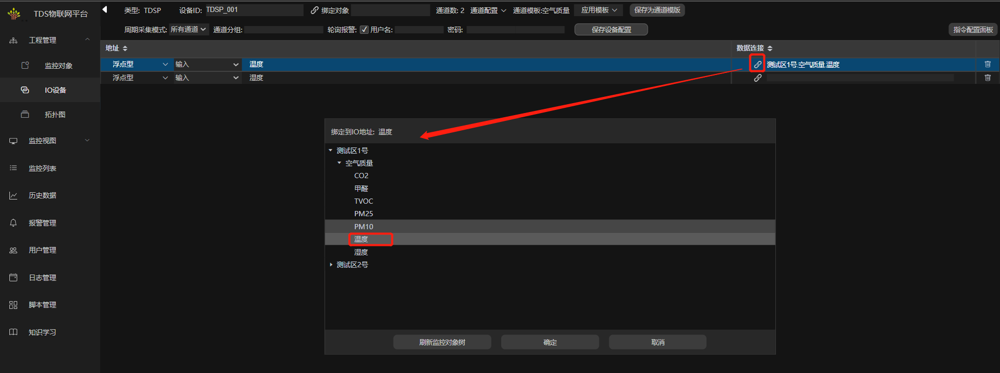
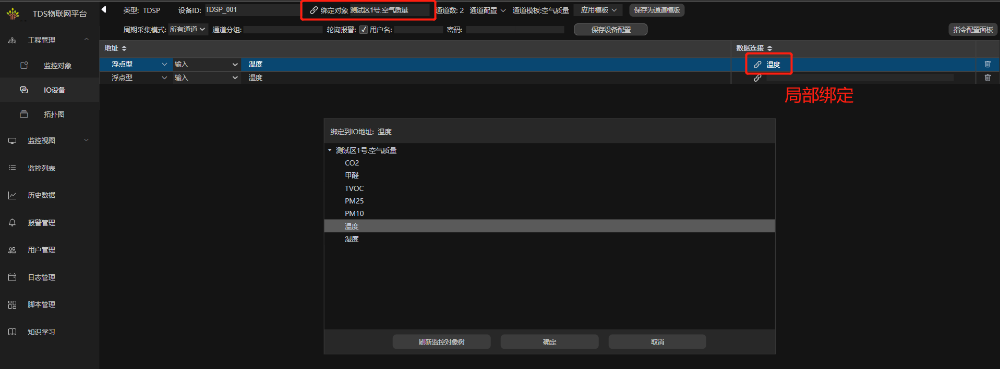
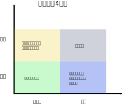

# IO设备管理

## 概述

IO设备管理功能包含：

* 配置系统当中的 IO设备

* 配置IO设备的地址

* 配置IO设备下的数据通道

* 将设备与监控对象绑定

* 将数据通道与监控点绑定

* 查看当前设备的实时在线状态

* 配置IO设备的周期采集策略，包含模式与周期

## 添加设备

在IO设备左上角，点击下拉选择需要添加的设备，点击添加设备按钮添加到设备列表。

如果需要添加1台子设备，例如将ModbusRTU设备添加到RS485网关下方，先点击选中网关设备，再点击添加设备按钮，新设备将被添加到选中设备的下方。



如果添加的设备是通过适配器连接的，统一添加TDSP设备，并勾选**使用适配器接入**

 

## 配置设备地址

**设备地址格式**

| 地址模式   | 字符串地址格式                | 说明                                                                                     |
| ------ | ---------------------- | -------------------------------------------------------------------------------------- |
| Tcp客户端 | 192.168.0.101:8090     | 设备作为Tcp客户端主动连接主机<br/><br/>                                                             |
| Tcp服务端 | 192.168.0.101          | 设备作为Tcp服务端等待主机主动连接                                                                     |
| UDP    | UDP-192.168.0.101:8090 | 在实际应用中，需要双向都能够主动发起通信<br/><br/>因此UDP模式下，设备既是UDP服务器同时也是UDP客户端                            |
| 设备ID   | 由设备协议自定义的任意格式字符串       | 在一般互联网环境下，该模式更为使用<br/>由于很多设备在路由器以下经过了NAT转换，使得无法使用IP地址来区分设备<br/>设备ID需要由设备应用层协议自主实现<br/> |

> 设备ID地址模式需要通信协议本身支持，可以在公网环境下使用
> 
> Tcp客户端，服务端 ,UDP模式只能在局域网环境下使用

## 配置通道

每个设备下可能包含多个数据通道，点击 配置 图标，进入单台设备的详细配置页面



可以通过3种方式添加通道

| 方式       | 说明             |
| -------- | -------------- |
| 单个通道手工添加 |                |
| 自动扫描     | 需要硬件协议本身支持     |
| 应用通道模版   | 预先将配置好的通道保存为模版 |



## 保存修改

#### 通过右键菜单保存

右键点击需要保存的设备行，在弹出的右键菜单选择“保存配置”



#### 设备详情配置页面保存按钮



## 通道模版

同一类的设备，通道配置一般是相同的。可以通过通道模版功能快速配置某类设备的通道。

完成1台设备的通道配置后，点击“保存为通道模版”按钮，输入模版版名称，下次便可以直接应用该模版



## 周期采集参数

#### 是否主动采集

勾选是否主动采集，并配置采集周期，服务将对设备进行数据轮询。

某些设备是主动上送的。可以不勾选。

某些设备不支持主动采集命令，那么该勾选无效。

#### 采集策略(高级参数)

仅TDSP设备支持该配置。该配置涉及到TDSP协议的使用。请参考TDSP协议文档。

周期采集将向设备发送 **acq**命令，以下3中模式对应了acq命令的三种不同参数

周期采集可以以以下3种模式进行采集：

* 所有通道： 周期发送采集所有通道的指令，采集所有通道数据

* 通道分组： 周期发送通道分组采集命令，采集多个通道分组

* 单个通道： 周期发送逐个通道采集命令

如果使用适配器模式，在适配器的协议转换实现当中，可以将 单通道读取，分组读取映射到某一条具体的设备通信协议。

如果设备内部有报警状态，可以勾选**轮询报警**，将发送TDSP协议的getAlarmStatus命令

**单通道模式**

```json
{
    "jsonrpc": "2.0", "method": "acq",  
    "params": {
       "ioAddr":  "temp"//读取温度通道 temp
    }, 
    "id": 1, 
    "ioAddr": "0000000000001"
}
```

**所有通道模式**

```json
{
    "jsonrpc": "2.0", "method": "acq",  
    "params": {
       //参数为空默认读取所有通道
    }, 
    "id": 1, 
    "ioAddr": "0000000000001"
} 
```

**通道组模式**

```json
{
    "jsonrpc": "2.0", "method": "acq",  
    "params": {
       "group":"switches"//读取开关通道分组
    }, 
    "id": 1, 
    "ioAddr": "0000000000001"
} 
```

## 配置数据绑定

硬件的通信参数配置完成后，通过配置数据绑定，将采集的数据送入指定的监控对象或者监控点。或者当使用监控对象或者监控点进行控制命令输出时，可以找到对应的设备。

### 全局绑定

在数据通道的数据连接列，点击绑定，选择指定监控点的位号



### 局部绑定

先将设备与一个监控对象绑定，此时绑定通道时，无需选择位号的完整名称，只要选择监控点相对于监控对象的相对位号即可。

例如 设备下的 通道1需要绑定   测试区1号.空气质量.温度。

局部绑定分两个步骤进行绑定：

* 1.设备绑定到监控对象

* 2.通道绑定到监控点（使用相对位号）



### 绑定模版

一般来说，同类设备的通道是固定的，和某一个对象下监控点的绑定关系也是固定的

例如空气质量设备下有通道  temp 和 humidity，这两个通道都和 监控对象的 "温度"和“湿度”两个监控点绑定，因此当使用**局部绑定**的配置方式时，通道的绑定关系可以模板化。

只要完成局部绑定当中的第一步**设备绑定到监控对象**就可以了，通道绑定可以直接应用模版。

绑定模版配置好后，保存在通道模版中。点击“保存为通道模版”按钮进行保存，通过应用模版应用某一个具体的通道配置及其绑定配置。

## Modbus数据类型

### 4字节数据类型

如果一个UInt32数据共4个字节，按照高位在前，低位在后，用AB CD，分别表示4个字节，

那么Modbus寄存器可以按照如下方式存储:

* AB CD

* CD AB

* BA DC

* DC BA


## 常见操作流程

### 替换设备

1.进入IO管理页面。并给设备上电，配置好服务器地址


2.修改准备替换的原有设备的设备ID, 修改为新上线的未分配设备ID,并保存


3.删除未分配的新设备。触发设备重新上线

删除未分配


替换设备上线


## 故障排查

### 设备连不上

* 第一步 都先用 netstat -ano | findstr 665 检查 tcp连接在不在    
* 第二步 检查设备有没有网上发数据
* 第三步 网关ID配置对不对
* 最后一步 重启硬件试试，可能是某种运行一段时间会出现的bug    

### 4G设备异常分析与应对机制

使用串口转4g模式透传硬件通信的结果下的常见问题分析。

* 1.设备不连接（没有tcp连接）
  检查4g模块后台的服务器ip端口配置
  重启4g模块设备

* 2.有tcp连接但设备不上线
  检查首发包（注册包）的配置。
  一般4g模块支持配置工具或者管理后台配置。

* 3.有tcp连接,设备上线,但是没有数据
  一般是4g模块的首发注册包已经成功收到了，但是硬件主板和4g模块的交互可能存在问题
  可以尝试重启设备。联合硬件排查原因
  硬件如果不断内存泄漏，死机后可能会出现该状况

* 4.有tcp连接,设备上线,第一包数据回包。但是后面的包就不回包了。

* 5.连接回复错误数据包
  如果连接时正确，运行一段时间后变成错误。可能是设备端的bug。上位机可以识别该连接重启设备应对  
  或者手工重启硬件。
  4g模块自主注册是tcp通信，是可靠链路，要么收不到，能收到数据一定正确。但串转网是不可靠链路。如果数据包错误是偶现的，可能是4g模块和控制板的串口连接存在问题。

## 设备管理基本概念



## 附录：支持的设备类型及默认端口

| 设备类型        | 说明                                                      | 默认端口 |
| ----------- | ------------------------------------------------------- | ---- |
| TDSP设备      | TDS的内置硬件通信协议，可以按此协议开发接入TDS<br>,也可以通过Adaptor服务转换协议后接入TDS | 665  |
| ModbusRTU设备 | 串口RTU通过485网关接入TDS的模式                                    | 664  |
| ModbusTCP   | modbusTcp协议                                             | 502  |
| IQ60        | 深圳傲华尔科技智能边缘控制网关设备                                       | 663  |
| Visca摄像机    | 通过Visca协议控制的摄像机                                         | 660  |
| Onvif摄像机    | 通过Onvif协议控制的摄像机                                         | 80   |
