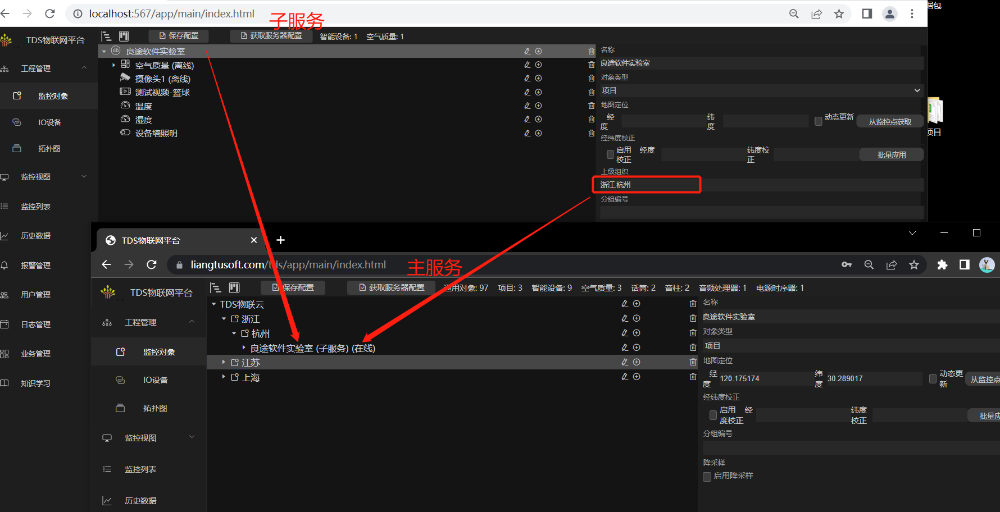

# 监控对象管理

## 基本概念

### 监控对象树

监控对象根据所属关系，按照父子节点组织成1颗对象树。软件所有的管理都基于这颗监控对象树。

在监控对象管理中，对监控对象树的结构，每个节点的参数，类型进行配置

### 对象类型

在TDS软件中，所有被监控的目标都被称为**对象**，对象类型按照下图划分，类型可以进一步划分子类型

| 类型名称    | 说明                                                                                                                                                                                                                                                                           |
| ------- | ---------------------------------------------------------------------------------------------------------------------------------------------------------------------------------------------------------------------------------------------------------------------------- |
| 对象      | 监控树上的所有节点都是对象                                                                                                                                                                                                                                                                |
| 组织结构    | 例如：浙江，杭州，XX公司，三楼等都可以作为组织结构  组织结构可以包含用户，用户属于某一个组织结构并且只有该组织结构下的 浏览权限                                                                                                                                                                                               |
| 自定义组织结构 | 在某一类项目中，可能有一种特定的组织结构。例如“机场”，“车站”，“车间”，自定义组织结构一般为某一类项目特有。在查看项目数据时，软件可以生产同一种自定义组织结构的列表，方便数据查看。  例如生成列表： 1号车间，2号车间，3号车间。都是属于车间类型，用户选择对应的车间，就可以查看对应车间以下的数据。  自定义组织结构可以在GIS地图上展示，用户可以通过拖拉配置在地图上的位置                                                                |
| 监控对象    | 可以自定义例如，XX园区，XX大楼，5号机床，都可以作为监控对象  类似组织结构，这是一个很泛指的类型，与组织结构的区别是监控对象不容纳用户                                                                                                                                                                                               |
| 自定义监控对象 | 在大部分物联系统中，往往是批量监控同一类的设备。例如：热能泵监控项目，系统中的对象都是热能泵。鱼塘监测项目，系统中的对象都是鱼塘。  类似自定义组织结构，系统会生成同类自定义监控对象列表，方便查看数据。  例如配置了“鱼塘”自定义监控对象，就可以查看一个鱼塘列表，查看1号鱼塘，2号鱼塘等多个鱼塘的实时溶解氧状态，水泵状态，投料机状态                                                                                      |
| 监控点     | 监控是系统中一个具体的监控数据，例如： 水泵开关状态， 水温，空气湿度。一般来说对应1个单独的传感器  一个监控对象往往包含了多个下属的监控点，例如：热能泵对象，下属包含了 "进水温度"，"回水温度"，”泵开关“等多个监控点                                                                                                                                                     |
| 监控点组    | 监控点组一般属于某一个监控对象，对该监控对象下的某一类监控点进行分组。  例如监控对象鱼塘，可以下设一个“水参数”监控点组，包含溶解氧，温度等监控点。  又可以下设一个“投料机”监控点组，包含功率，电流，开关状态等监控点。 监控点和监控点组中的监控点都可以看成是父节点对象的属性。 非监控点组下面的监控点，不能看做父节点的对象的属性。 例如 车间的温度，湿度可以看作是房间的属性，但是车间里有5台变压器，他们的电流和电压不是房间的属性，而是变压器的属性。车间仅仅作为变压器的容器。 |

## 监控树的参考配置方式

* 先配置组织结构

* 在组织结构下面添加监控对象

* 在监控对象下添加监控点

* 如果这是一个XX设备监控项目，你可以把相对应的监控对象改为自定义监控对象，并且取名为XX设备

## 配置界面

左侧点击监控树上的节点，可以在左侧配置其参数

| 属性名称   | 说明                                                                                                                    |     |
| ------ | --------------------------------------------------------------------------------------------------------------------- | --- |
| 名称     | 监控对象的名字，与父监控对象的名字一级级组成位号                                                                                              |     |
| 对象类型   | 组织结构；自定义组织结构；项目；监控对象； 自定义监控对象；监控点；监控点组；                                                                               |     |
| 值类型    | 1.浮点  2.布尔 3.字符串 4.json 5.视频                                                                                          |     |
| 数据保存方式 | 1.周期保存  2.全部保存 3.数据改变时保存                                                                                              |     |
| 变化死区   | 数据变化大于该值时才认为数据变化。当认为数据变化时，服务会进行如下操作：  1.通知数据服务的客户端。例如页面，或者主服务 2.如果数据保存策略为变化时保存，那么则保存数据                    |     |
| 值有效范围  | 该数值可以方便界面展示，设定后，界面可以将展示的图片的y轴上下限确定 或者有数据输出的需求时，可以判定用户输出的值为无效值。也可以用来设定输出滑动条的上下限。                                   |     |
| 报警阈值   | 上下限报警功能。启用后。可以在报警管理里面查看数据报警。                                                                                          |     |
| 线性修正倍率 | 从硬件采集的数值为x，那么监控点的值y为  y=Kx+B                                                                                          |     |
| 降采样    | 某些数据为高频监测点，例如40ms就有1个数据点，这类数据可以进行将采样，减少数据服务和他的客户端之间的通信。例如某个点的采样频率为40ms，如果设置降采样周期为10000毫秒，那么每过10000毫秒，1个变化的数据才会被通知给客户端 |     |

## 自定义监控对象

系统当中标准化的一类监控对象，在实际应用中，可以将这些监控对象配置为**自定义监控对象**，例如”鱼塘“监控对象，每个该监控对象都有”温度“，”湿度“，”溶解氧“等监控点，一般来说**鱼塘**监控对象的监控内容是标准化的，那么可以配置一个”鱼塘“类型的自定义监控对象。

## 监控点

### 内部变量

内部变量属于不从硬件采集的数据点，一般从其他监控点计算而来。

内部变量需要配置一个计算表达式。

例如内部变量监控点名称为 "总用电量"，可以配置计算表达式为 

> sum("*楼.用电量")

表达式语法为javascript脚本，可以调用TDS内置脚本函数，参考文档
[TDS脚本管理](manual-script?id=脚本管理)

## 子服务功能

数据服务可以按照子服务与主服务的模式部署，子服务的整个监控对象树，包含配置与实时数据，都可以同步到主服务

完成本地配置，并接入硬件以后，完成以下2项配置，将子服务接入到主服务

**1.配置tds.ini**

配置主服务的地址与端口号，子服务启动后，将自动连接主服务。

主服务的默认端口是661

> masterTds = cloud.liangtusoft.com:661

**2.配置子服务的位号**

在子服务的监控对象页面，选择根节点，配置**上级组织**

当子服务连接主服务后，将自动注册到主服务监控对象树的对应位置

