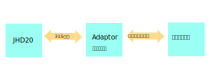

**适配器使用说明书**
===========================================================
# 概要
适配器软件用于将标准的315协议转换为和各个厂家相匹配的协议


# 运行目录各文件明细
文件|功能
-|-
run.cmd|双击该文件运行程序
node.exe|运行环境exe文件
ffmpeg.exe|运行环境exe文件
10号线车站名称.xlsx|与四川众和同步，确保获取到最新的车站名称配置
Log|日志文件夹
Temp|数据备份文件夹

# conf.json 配置文件配置说明
```javascript
{
	"tcpClient":{ //配置站机的IP和端口
		"host" : "127.0.0.1",
		"port" : 9990
	},
	"tcpServer":{ //配置本软件(提供给集中监测的)的IP和端口
		"port" : 9999
	},
	"sshServer":{ //配置四川众和SSH文件服务的的IP，端口，用户名，密码
		"host": "222.209.216.202",
		"port": 4321,
		"username": "fctest",
		"password": "fctest"
	},
	"adaptor":{ //本软件的相关配置
		"stationID" : "TPY", //站点ID,由众合分配，需要由众合确认 《n号线车站名称.xlsx》是否为最新版本，然后根据当前配置站点，找到对应的SSTATION_CODE，比如当前在太平园站，此处配置TPY
		"TempDir" : "./Temp/", //临时文件路径，该文件会备份发送给ssh服务器的文件，以供现场问题排查
		"RemoteSSHRoot" : "/home/fctest/", //远程SSH文件夹的根路径，该路径需要向四川众和方确认
		"LogDir" : "./Log/" //日志路径
	}
}
```
# 操作步骤
1. 建议部署位置，站机主程序运行路径下  /CSMAdaptor
2. 修改配置，确保每一项配置都符合实际现场情况，明细已在1.2中给出
3. 双击run.cmd运行程序
4. 观察弹出的命令行窗口，是否连接成功，是否有命令交互