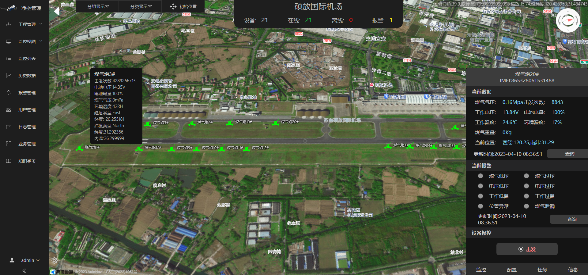
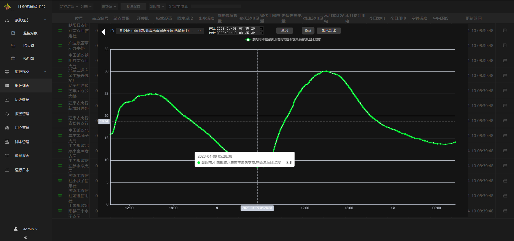
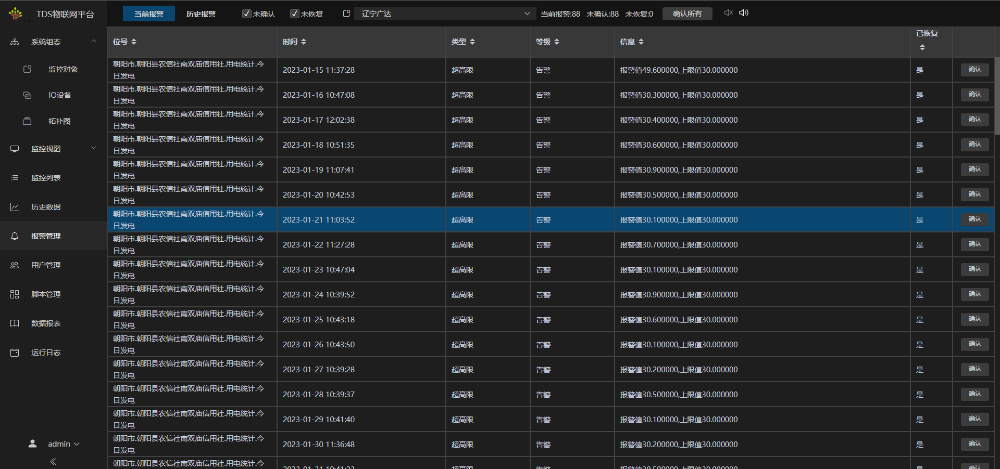

## 通用平台简介

* TDS是一款结合**一般传感器监控**与**视频图像监控**的轻量级物联网通用监控平台。
* TDS同时是一款物联网**组态软件**，在不同的应用场景，只需要进行不同的组态配置而无需进行重复开发。
* 利用Modbus，OPC UA，MQTT等数据接入协议，TDS可以应用于传统的**SCADA软件**应用场景。
* TDS支持多租户，多类型终端接入，适用于物联网SAAS平台应用。

面对大量差异化、碎片化、小微化的物联网监控场景，利用数据接入、监控画面、报警多个层面的组态配置功能，帮助企业快速、低成本构建物联网监控项目。

> 对于行业物联网监控场景，可以基于TDS进行前后端功能模块扩展，快速实现

### TDS数据服务开源版本

gitee项目链接：https://gitee.com/liangtuSoft/tds

## TDS功能速览

### 监控对象配置

业务系统根据**组织结构**，**监控对象** 组织成树形结构，并可以配置每个树节点的类型，参数信息

### 设备接入配置(IO配置)

配置设备的类型，地址，通道参数

### GIS视图

以地图的方式查看当前监测点的实时数据，实时报警状态等信息。支持监测对象选择，根据属性进行数据过滤等操作。

### 数据可视化

### 查看实时数据

查看位号的当前数据，进行开关量或者模拟量输出控制，查看实时码流，云台控制， 查看实时高频数据流曲线

### 历史趋势查询

通过监控对象与时间范围过滤查看历史数据，支持同坐标轴多位号对比，并列对比查看

### 报警管理

报警管理界面可以查看当前报警，包含未确认与未恢复的报警。可以在历史报警查询界面，通过时间，位号，报警类型查询历史报警

## 自定义脚本

## 自定义报表

## 用户管理

分配用户所属组织结构，角色，位号的读写权限。实现云平台部署的多租户使用，以及分角色的读写权限管理

### IO服务接入

基础版TDSKit支持接入 modbus-RTU;Onvif;rtsp码流;mqtt;OPC UA;涂鸦IOT平台

